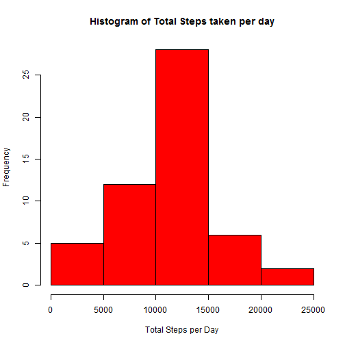
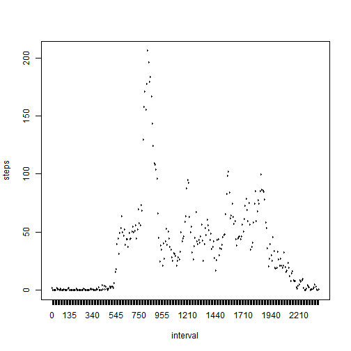
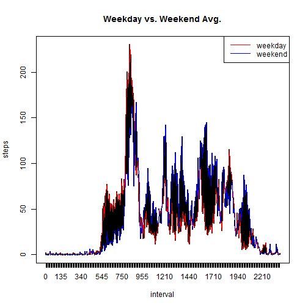

# Reproducible Research: Peer Assessment 1


## Loading and preprocessing the data


```r
### 1. Read in the data.
library(ggplot2)
library(scales)

if (!file.exists("activity.csv")) {
    unzip("activity.zip")
}
activity <- read.csv("activity.csv")

### 2. Convert the date field to Date class and interval field to Factor class.

activity$date <- as.Date(activity$date, format = "%Y-%m-%d")
activity$interval <- as.factor(activity$interval)
```

## Find the mean total number of steps taken per day.(Ignore the missing values.)


```r
### 1.Make a histogram of the total number of steps taken each day
library(ggplot2)

total.steps <- aggregate(steps ~ date, data = activity, sum, na.rm = TRUE)

hist(total.steps$steps, col = "red", xlab = "Total Steps per Day", ylab = "Frequency", 
    main = "Histogram of Total Steps taken per day")
```

 

```r
### 2.Calculate and report the mean and median total number of steps taken per day

mean(total.steps$steps)
```

```
## [1] 10766.19
```

```r
median(total.steps$steps)
```

```
## [1] 10765
```
## Find the average daily activity pattern.

```r
### 1.Make a time series plot (i.e. type = "l") of the 5-minute interval (x-axis) and the average number of steps taken, averaged across all days (y-axis)

steps.interval <- aggregate(steps ~ interval, data = activity, FUN = mean)
plot(steps.interval, type = "l")
```

 

```r
### 2.Find the 5-minute interval, which on average across all the days in the dataset,contains the maximum number of steps.

steps.interval$interval[which.max(steps.interval$steps)]
```

```
## [1] 835
## 288 Levels: 0 5 10 15 20 25 30 35 40 45 50 55 100 105 110 115 120 ... 2355
```
`
## Imputing missing values

```r
### Note that there are a number of days/intervals where there are missing values (coded as NA). The presence of missing days may introduce bias into some calculations or summaries of the data.

### 1.Calculate and report the total number of missing values in the dataset (i.e. the total number of rows with NAs)
sum(is.na(activity))
```

```
## [1] 2304
```

```r
### 2.Devise a strategy for filling in all of the missing values in the dataset. The strategy does not need to be sophisticated. For example, you could use the mean/median for that day, or the mean for that 5-minute interval, etc.

### fill in for missing values = the means for the 5-minute intervals as fillers .
### 3.Create a new dataset with the missing data filled in.
activity <- merge(activity, steps.interval, by = "interval", suffixes = c("", 
    ".y"))
nas <- is.na(activity$steps)
activity$steps[nas] <- activity$steps.y[nas]
activity <- activity[, c(1:3)]

###4.Make a histogram of the total number of steps taken each day and Calculate and report the mean and median total number of steps taken per day. Do these values differ from the estimates from the first part of the assignment? What is the impact of imputing missing data on the estimates of the total daily number of steps?

total.steps2 <- aggregate(steps ~ date, data = activity, sum, na.rm = TRUE)
hist(total.steps2$steps, col = "blue", xlab = "Total Steps per Day", ylab = "Frequency", main = "Histogram of Total Steps taken per day")
```

 
## Find if there are differences in activity patterns between weekdays and weekends.


```r
### For this part the weekdays() function may be of some help here. Use the dataset with the filled-in missing values for this part.

### 1.Create a new factor variable in the dataset with two levels ??? ???weekday??? and ???weekend??? indicating whether a given date is a weekday or weekend day.

### 2.Make a panel plot containing a time series plot (i.e. type = "l") of the 5-minute interval (x-axis) and the average number of steps taken, averaged across all weekday days or weekend days (y-axis). See the README file in the GitHub repository to see an example of what this plot should look like using simulated data.

activity$date <- as.Date(strptime(activity$date, format="%Y-%m-%d")) 
activity$day <- weekdays(activity$date)
for (i in 1:nrow(activity)) {
  if (activity[i,]$day %in% c("Saturday","Sunday")) {
activity[i,]$day<-"weekend"
}
    else{
        activity[i,]$day<-"weekday"
        }
}

stepsByDay <- aggregate(activity$steps ~ activity$interval + activity$day, activity, mean)

names(stepsByDay) <- c("interval", "day", "steps")
par(mfrow=c(1,1))  
with(stepsByDay, plot(steps ~ interval, type="n", main="Weekday vs. Weekend Avg."))  
with(stepsByDay[stepsByDay$day == "weekday",], lines(steps ~ interval, type="l", col="red"))  
with(stepsByDay[stepsByDay$day == "weekend",], lines(steps ~ interval, type="l", col="blue" ))
legend("topright", lty=c(1,1), col = c("red", "blue"), legend = c("weekday", "weekend"), seg.len=3)
```

 

